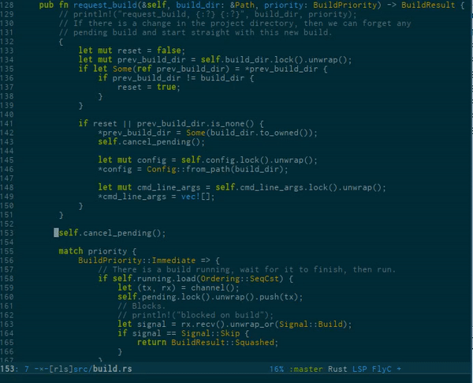
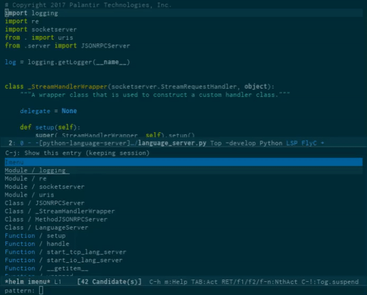
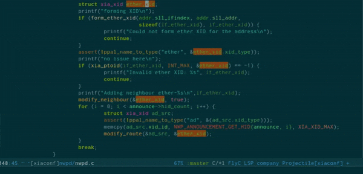

Emacs Language Server Client
=========

[](https://gitter.im/emacs-lsp/lsp-mode?utm_source=badge&utm_medium=badge&utm_campaign=pr-badge&utm_content=badge)

[](https://travis-ci.org/emacs-lsp/lsp-mode)
[](https://stable.melpa.org/#/lsp-mode)
[](http://melpa.org/#/lsp-mode)

Client for [Language Server Protocol](https://github.com/Microsoft/language-server-protocol/) (v3.0). [lsp-mode](https://github.com/emacs-lsp/lsp-mode) aims to provide IDE-like experience by providing optional integration with the most popular Emacs packages like `company`, `flycheck` and `projectile`.

* As you type reporting of parsing and compilation errors (via [flycheck](https://github.com/flycheck/flycheck)/[lsp-ui](https://github.com/emacs-lsp/lsp-ui))
* Code completion - using [company-lsp](https://github.com/tigersoldier/company-lsp) or builtin ```complete-at-point```
* Hovers - using [lsp-ui](https://github.com/emacs-lsp/lsp-ui)
* Code actions - using [lsp-ui](https://github.com/emacs-lsp/lsp-ui)
* Code outline - using builtin [imenu](https://www.gnu.org/software/emacs/manual/html_node/emacs/Imenu.html)
* Code navigation - using builtin [xref](https://www.gnu.org/software/emacs/manual/html_node/emacs/Xref.html)
* Code lens (references/implementations) - using builtin [xref](https://www.gnu.org/software/emacs/manual/html_node/emacs/Xref.html)
* Highlights
* Code formatting
* Visual debugger - [dap-mode](https://github.com/yyoncho/dap-mode/)

## Installation

### Install via melpa
The recommended way to install `lsp-mode` is via `package.el` - the built-in package manager in Emacs. `lsp-mode` is available on the two major `package.el` community maintained repos - [MELPA Stable](http://stable.melpa.org) and [MELPA](http://melpa.org).

### Spacemacs
[lsp-mode](https://github.com/emacs-lsp/lsp-mode) is included in spacemacs. Add `lsp` to `dotspacemacs-configuration-layers` and configure the language that you want to use to be backed by `lsp` backend.

<kbd>M-x</kbd> `package-install` <kbd>[RET]</kbd> `lsp-mode` <kbd>[RET]</kbd>

## Configuration
Add the following line in your configuration file where `programming-mode-hook` stands for the language specific hook like `python-mode-hook`.  In addition, `lsp-mode` will automatically detect and configure [lsp-ui](https://github.com/emacs-lsp/lsp-ui) and [company-lsp](https://github.com/tigersoldier/company-lsp). To turn off that behaviour you could set `lsp-auto-configure` to `nil`.
``` emacs-lisp
(require 'lsp)
(add-hook 'programming-mode-hook 'lsp)
```

## Supported languages
Some of the servers are directly supported by `lsp-mode` by requiring
`lsp-clients.el` while other require isntalling additional package which provide
server specific functionality.


| Language              | Language Server                                                                                | Built-in                                                             | Installation command                                                                |
|-----------------------|------------------------------------------------------------------------------------------------|----------------------------------------------------------------------|-------------------------------------------------------------------------------------|
| Bash                  | [bash-language-server](https://github.com/mads-hartmann/bash-language-server)                  | Yes                                                                  | npm i -g bash-language-server                                                       |
| C++                   | [ccls](https://github.com/MaskRay/ccls)                                                        | [emacs-ccls](https://github.com/MaskRay/emacs-ccls) (TBD)            | Refer to [ccls](https://github.com/MaskRay/ccls)                                    |
| C++                   | [clangd](https://clang.llvm.org/extra/clangd.html)                                             | Yes                                                                  | Refer to [clangd](https://clang.llvm.org/extra/clangd.html)                         |
| C++                   | [cquery](https://github.com/cquery-project/cquery)                                             | [emacs-cquery](https://github.com/cquery-project/emacs-cquery) (TBD) | Refer to [cquery](https://github.com/cquery-project/cquery)                         |
| CSS                   | [css](https://github.com/vscode-langservers/vscode-css-languageserver-bin)                     | Yes                                                                  | npm install -g vscode-css-languageserver-bin                                        |
| Go                    | [go-langserver](https://github.com/sourcegraph/go-langserver)                                  | Yes                                                                  | go get -u github.com/sourcegraph/go-langserver                                      |
| Groovy                | [groovy-language-server](https://github.com/palantir/language-servers)                         | Yes                                                                  | Refer to [groovy-language-server](https://github.com/palantir/language-servers)     |
| HTML                  | [html](https://github.com/vscode-langservers/vscode-html-languageserver)                       | Yes                                                                  | npm install -g vscode-html-languageserver-bin                                       |
| Haskell               | [IDE engine](https://github.com/haskell/haskell-ide-engine)                                    | (TBD)                                                                | Refer to [IDE engine](https://github.com/haskell/haskell-ide-engine)                |
| JSON                  | [vscode-json-languageserver](https://github.com/vscode-langservers/vscode-json-languageserver) | Yes                                                                  |                                                                                     |
| Java                  | [Eclipse JDT LS](https://github.com/eclipse/eclipse.jdt.ls)                                    | [lsp-java](https://github.com/emacs-lsp/lsp-java)                    | Automatic by [lsp-java](https://github.com/emacs-lsp/lsp-java)                      |
| Javascript/Typescript | [javascript-typescript-stdio](https://github.com/sourcegraph/javascript-typescript-langserver) | Yes                                                                  | npm i -g javascript-typescript-langserver                                           |
| Ocaml                 | [ocaml-language-server](https://github.com/freebroccolo/ocaml-language-server)                 | (TBD)                                                                |                                                                                     |
| PHP                   | [php-language-server](https://github.com/felixfbecker/php-language-server)                     | Yes                                                                  | Refer to [php-language-server](https://github.com/felixfbecker/php-language-server) |
| Python                | [pyls](https://github.com/palantir/python-language-server)                                     | Yes                                                                  | pip install 'python-language-server[all]'                                           |
| Ruby                  | [solargraph](https://github.com/castwide/solargraph)                                           | Yes                                                                  | gem install solargraph                                                              |
| Rust                  | [rls](https://github.com/rust-lang-nursery/rls)                                                | Yes                                                                  | Refer to [rls](https://github.com/rust-lang-nursery/rls)                            |
| Scala                 | [lsp-scala](https://github.com/rossabaker/lsp-scala)                                           | TBD                                                                  |                                                                                     |
## Examples

### Completion
Completion is provided with the native `completion-at-point` (<kbd>C</kbd>-<kbd>M</kbd>-<kbd>i</kbd>),
and should therefore work with any other completion backend. Async completion is provided by
[company-lsp](https://github.com/tigersoldier/company-lsp).


### `eldoc` (Help on hover)
Hover support is provided with `eldoc`, which should be enabled automatically.


### Goto definition
Use <kbd>M</kbd> - <kbd>.</kbd> (`xref-find-definition`)
to find the definition for the symbol under point.


### Symbol references
Use <kbd>M</kbd> - <kbd>?</kbd> (`xref-find-references`)
to find the references to the symbol under point.


### Symbol Highlighting


### Imenu


#### With [helm-imenu](https://github.com/emacs-helm/helm)


### Rename
Use <kbd>M</kbd> - <kbd>x</kbd> `lsp-rename`.



### Hooks
`lsp-mode` provides a handful of hooks that can be used to extend and configure
the behaviour of language servers. A full list of hooks is available in the
[API documentation](./doc/API.org).

## Adding support for languages
See [API docs](./doc/API.org)

Here it is the minimal configuration that is needed for new language server registation. Refer to the documentation of `lsp--client` for the additional settings supported on registration time. `lsp-language-id-configuration` must be updated to contain the corresponding mode -> language id - in this case `(python-mode . "python")`
``` emacs-lisp
(lsp-register-client
 (make-lsp-client :new-connection (lsp-stdio-connection "pyls")
                  :major-modes '(python-mode)
                  :server-id 'pyls))
```

### See also
* [`dap-mode`](https://github.com/yyoncho/dap-mode) - Debugger integration for
* [`eglot`](https://github.com/joaotavora/eglot) - An alternative and lighter LSP implementation.
