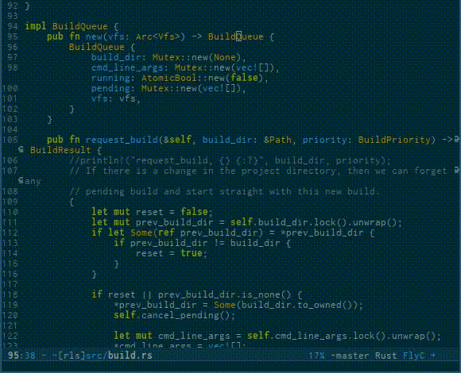
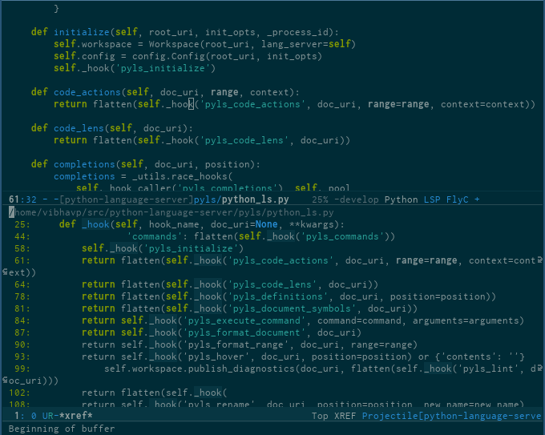

emacs-lsp
=========

[](https://gitter.im/emacs-lsp/lsp-mode?utm_source=badge&utm_medium=badge&utm_campaign=pr-badge&utm_content=badge)

[](https://travis-ci.org/emacs-lsp/lsp-mode)
[](http://melpa.org/#/lsp-mode)

A Emacs Lisp library for implementing clients for servers using Microsoft's
[Language Server Protocol](https://github.com/Microsoft/language-server-protocol/).

The library is designed to integrate with existing Emacs IDE frameworks
(completion-at-point, xref (beginning with Emacs 25.1), flycheck, etc).

*This package is still under development, and is not recommended for daily use.*
## Installation

Clone this repository to a suitable path, and add
```emacs-lisp
(add-to-list 'load-path "<path to emacs-lsp>")
(require 'lsp-mode)
(global-lsp-mode t)
(with-eval-after-load 'lsp-mode
    (require 'lsp-flycheck))
```
to your .emacs.

## Clients
Support for programming languages is provided by the following packages:

- [lsp-rust](https://github.com/emacs-lsp/lsp-rust)
- [lsp-go](https://github.com/emacs-lsp/lsp-go)
- [lsp-python](https://github.com/emacs-lsp/lsp-python)
- [lsp-haskell](https://github.com/emacs-lsp/lsp-haskell)
- [lsp-java](https://github.com/emacs-lsp/lsp-java)

## Adding support for languages
See [API docs](./doc/API.org)

## Examples

### completion
Completion is provided with the native `completion-at-point` (<kbd>C</kbd>-<kbd>M</kbd>-<kbd>i</kbd>),
 and should therefore work with any other completion backend.


### `eldoc` (Help on hover)
Hover support is provided with `eldoc`, which should be enabled automatically.


### Goto definition
Use <kbd>M</kbd> - <kbd>.</kbd> (`xref-find-definition`)
to find the definition for the symbol under point.



### Symbol references
Use <kbd>M</kbd> - <kbd>?</kbd> (`xref-find-references`)
to find the references to the symbol under point.



### Flycheck

